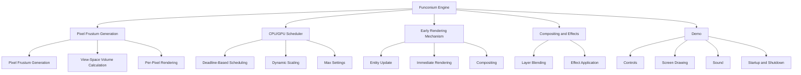

# Funconium Engine Architecture Diagram

## Overview

The Funconium Engine is designed to leverage **time-domain rendering**, where each pixel owns a view-space volume (frustum) and the renderer spends time inside that volume until the frame deadline hits. This approach treats rendering as a real-time scheduling problem, not a graphics one.

## Architecture Diagram



## Component Interfaces and APIs

### Pixel Frustum Generation

#### Pixel Frustum Generation
- **Function**: `generate_pixel_frustum`
- **Input**: Pixel coordinates, eye position, screen dimensions
- **Output**: 4-sided pyramid (frustum) for the pixel

#### View-Space Volume Calculation
- **Function**: `calculate_view_space_volume`
- **Input**: Pixel frustum, scene data
- **Output**: View-space volume for the pixel

#### Per-Pixel Rendering
- **Function**: `render_pixel`
- **Input**: View-space volume, time budget
- **Output**: Rendered pixel color

### CPU/GPU Scheduler

#### Deadline-Based Scheduling
- **Function**: `schedule_frame`
- **Input**: Desired FPS, current time
- **Output**: Frame deadline

#### Dynamic Scaling
- **Function**: `scale_workload`
- **Input**: Available compute power, workload
- **Output**: Scaled workload

#### Max Settings
- **Function**: `set_max_settings`
- **Input**: Desired FPS
- **Output**: Maximum settings for the given FPS

### Early Rendering Mechanism

#### Entity Update
- **Function**: `update_entity`
- **Input**: Entity state, next frame state
- **Output**: Updated entity state

#### Immediate Rendering
- **Function**: `render_entity`
- **Input**: Updated entity state
- **Output**: Rendered entity in temporary buffer

#### Compositing
- **Function**: `composite_frame`
- **Input**: Temporary buffers
- **Output**: Final frame

### Compositing and Effects

#### Layer Blending
- **Function**: `blend_layers`
- **Input**: Temporary buffers, blending parameters
- **Output**: Blended layers

#### Effect Application
- **Function**: `apply_effects`
- **Input**: Blended layers, effects
- **Output**: Final scene with effects

### Demo Components

#### Controls
- **Function**: `register_controls`
- **Input**: Control mappings
- **Output**: Registered controls

#### Screen Drawing
- **Function**: `draw_screen`
- **Input**: Scene data
- **Output**: Rendered screen

#### Sound
- **Function**: `play_sound`
- **Input**: Sound file, playback parameters
- **Output**: Audio playback

#### Startup and Shutdown
- **Function**: `initialize_engine`
- **Input**: Engine configuration
- **Output**: Initialized engine

- **Function**: `shutdown_engine`
- **Input**: Engine state
- **Output**: Cleaned up engine

## Data Structures

### Pixel Frustum
```c
typedef struct {
    float x1, y1, z1;
    float x2, y2, z2;
    float x3, y3, z3;
    float x4, y4, z4;
} PixelFrustum;
```

### View-Space Volume
```c
typedef struct {
    PixelFrustum frustum;
    float accumulated_radiance;
    float variance;
    float motion_sensitivity;
    float perceptual_importance;
} ViewSpaceVolume;
```

### Entity
```c
typedef struct {
    float x, y, z;
    float rotation;
    void* properties;
} Entity;
```

### Temporary Buffer
```c
typedef struct {
    void* data;
    size_t size;
} TemporaryBuffer;
```

### Control Mapping
```c
typedef struct {
    int key;
    void (*callback)(void);
} ControlMapping;
```

### Sound
```c
typedef struct {
    void* data;
    size_t size;
    int channels;
    int sample_rate;
} Sound;
```

## Conclusion

This architecture diagram and the outlined interfaces and APIs provide a clear structure for the Funconium Engine, aligned with the time-domain rendering approach. By following this architecture, we can ensure that the engine and demo meet the specified requirements and provide a solid foundation for future development.