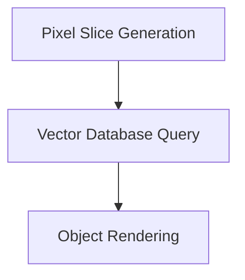
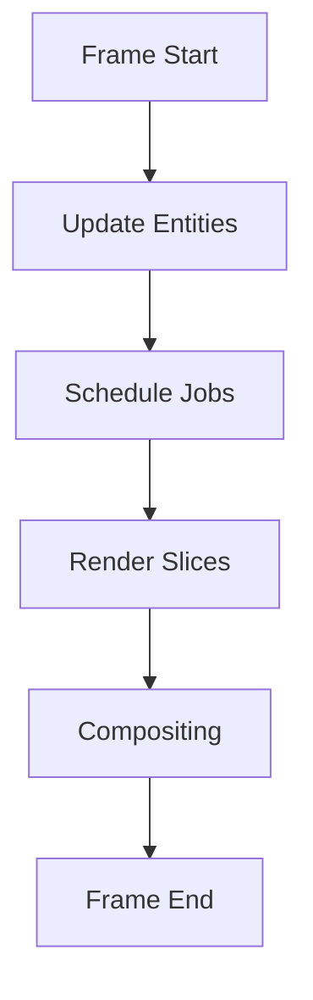
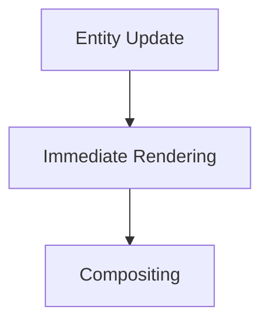
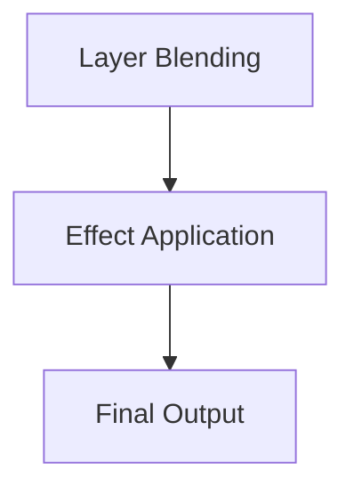

# Funconium Engine Architecture Guide

## Overview
The Funconium Engine is designed to leverage vector database techniques for rendering scenes, avoiding traditional BSP trees and other conventional methods. The architecture focuses on utilizing AVX512 FP16 instructions on CPUs and similar optimizations on GPUs to create a unified rendering pipeline.

## Key Components

### 1. Vector Database Pipeline
The vector database pipeline is the core of the Funconium Engine. It handles the assembly of the 3D scene by treating each pixel as a 4-point z-axis "slice" of the scene. This slice forms a long rectangular solid, with four points in each corner tracing out until they hit a vector database object.

#### Pipeline Steps:
1. **Pixel Slice Generation**: For each pixel, generate a 4-point z-axis slice.
2. **Vector Database Query**: Trace the points through the vector database to determine intersections with objects.
3. **Object Rendering**: Render objects as they are intersected by the slices.

### 2. CPU/GPU Scheduler
The scheduler is designed to meet a desired FPS by dynamically scaling the workload based on available compute power. The game slice rendering continues processing until the timer for the frame expires.

#### Scheduler Features:
- **Deadline-Based**: Ensures that the rendering process adheres to the desired FPS.
- **Dynamic Scaling**: Jobs are scaled to utilize all available compute power.
- **Max Settings**: The engine always operates at maximum settings for the given FPS, eliminating the need for manual adjustments.

### 3. Early Rendering Mechanism
Entities are updated in the CPU game loop, and as soon as their state for the next frame is determined, they are passed to the GPU for immediate rendering into a temporary buffer.

#### Early Rendering Steps:
1. **Entity Update**: The CPU updates the entity's position, orientation, and other properties.
2. **Immediate Rendering**: The updated entity is passed to the GPU for rendering into a temporary buffer.
3. **Compositing**: At the end of the CPU update loop, the temporary buffers are composited to form the final frame.

### 4. Compositing and Effects
Compositing involves blending the temporary buffers to create the final scene. This allows for out-of-order rendering and the application of effects.

#### Compositing Steps:
1. **Layer Blending**: Combine layers from the temporary buffers.
2. **Effect Application**: Apply effects such as lighting, shadows, and post-processing.
3. **Final Output**: Generate the final frame for display.

## Detailed Architecture

### Vector Database Pipeline

1. **Pixel Slice Generation**: Each pixel generates a 4-point z-axis slice. This slice is a rectangular solid that extends into the scene.
2. **Vector Database Query**: The slices are traced through the vector database to find intersections with objects. The vector database is optimized for fast queries using AVX512 FP16 instructions on the CPU and similar optimizations on the GPU.
3. **Object Rendering**: Objects are rendered as they are intersected by the slices. This allows for efficient rendering of complex scenes.

#### Pipeline Details:
- **Pixel Slice**: A 4-point z-axis slice is generated for each pixel. This slice is a rectangular solid that extends into the scene.
- **Vector Database**: The vector database stores objects in a way that allows for fast queries. Each object is represented as a set of vectors that define its boundaries and properties.
- **Intersection Detection**: The slices are traced through the vector database to detect intersections with objects. This is done using optimized algorithms that leverage AVX512 FP16 instructions on the CPU and similar optimizations on the GPU.
- **Rendering**: Objects are rendered as they are intersected by the slices. This allows for efficient rendering of complex scenes without the need for traditional BSP trees or other conventional methods.

### CPU/GPU Scheduler

1. **Frame Start**: The frame starts with the CPU updating entities.
2. **Update Entities**: Entities are updated based on the game logic.
3. **Schedule Jobs**: Jobs are scheduled dynamically based on the available compute power. The scheduler ensures that the workload is distributed evenly across the CPU and GPU.
4. **Render Slices**: The vector database pipeline renders the slices. Each slice is processed independently, allowing for parallel processing.
5. **Compositing**: The temporary buffers are composited to form the final frame. This involves blending layers and applying effects.
6. **Frame End**: The frame is displayed, and the process repeats.

#### Scheduler Details:
- **Deadline-Based**: The scheduler operates on a deadline-based system where the goal is to meet a desired FPS. The frame rendering process continues until the deadline is reached.
- **Dynamic Scaling**: Jobs are scaled dynamically based on the available compute power. This ensures that the engine always operates at maximum settings for the given FPS.
- **Parallel Processing**: The scheduler leverages parallel processing to distribute the workload evenly across the CPU and GPU. This allows for efficient rendering of complex scenes.

### Early Rendering Mechanism

1. **Entity Update**: The CPU updates the entity's state for the next frame. This includes updating the entity's position, orientation, and other properties.
2. **Immediate Rendering**: The updated entity is passed to the GPU for rendering into a temporary buffer. This allows the GPU to start rendering as soon as the entity's state is updated, without waiting for the entire game loop to complete.
3. **Compositing**: The temporary buffers are blended to form the final frame. This involves combining the rendered entities and applying effects.

#### Early Rendering Details:
- **Entity Update**: The CPU updates the entity's state for the next frame. This includes updating the entity's position, orientation, and other properties such as lighting and textures.
- **Immediate Rendering**: The updated entity is passed to the GPU for rendering into a temporary buffer. This allows the GPU to start rendering as soon as the entity's state is updated, without waiting for the entire game loop to complete.
- **Compositing**: The temporary buffers are blended to form the final frame. This involves combining the rendered entities and applying effects such as lighting, shadows, and post-processing.

### Compositing and Effects

1. **Layer Blending**: Layers from the temporary buffers are blended to form the final scene. This allows for out-of-order rendering and the application of effects.
2. **Effect Application**: Effects such as lighting, shadows, and post-processing are applied. This includes applying masks and blending layers to create the final scene.
3. **Final Output**: The final frame is generated and displayed.

#### Compositing and Effects Details:
- **Layer Blending**: Layers from the temporary buffers are blended to form the final scene. This allows for out-of-order rendering and the application of effects. The blending process is optimized to leverage the vector database for efficient layer management.
- **Effect Application**: Effects such as lighting, shadows, and post-processing are applied. This includes applying masks and blending layers to create the final scene. The effects are applied in a way that leverages the vector database for efficient processing.
- **Final Output**: The final frame is generated and displayed. This involves combining the blended layers and applying the final effects to create the output frame.

## Implementation Details

### Vector Database
The vector database is optimized for fast queries using AVX512 FP16 instructions on the CPU and similar optimizations on the GPU. This allows for efficient tracing of the 4-point z-axis slices through the scene.

### CPU/GPU Scheduler
The scheduler is designed to dynamically scale the workload based on the available compute power. This ensures that the engine always operates at maximum settings for the given FPS.

### Early Rendering
Entities are updated in the CPU game loop, and as soon as their state for the next frame is determined, they are passed to the GPU for immediate rendering into a temporary buffer. This allows for out-of-order rendering and the application of effects.

### Compositing
Compositing involves blending the temporary buffers to create the final scene. This allows for the application of effects such as lighting, shadows, and post-processing.

## Conclusion
The Funconium Engine architecture leverages vector database techniques to create a unified rendering pipeline that efficiently utilizes both CPU and GPU resources. The architecture is designed to meet a desired FPS by dynamically scaling the workload and allows for out-of-order rendering and the application of effects.

### Key Takeaways:
- **Vector Database Pipeline**: The core of the engine, enabling efficient scene assembly and rendering.
- **CPU/GPU Scheduler**: Ensures that the engine operates at maximum settings for the given FPS by dynamically scaling the workload.
- **Early Rendering Mechanism**: Allows the GPU to start rendering as soon as the entity's state is updated, without waiting for the entire game loop to complete.
- **Compositing and Effects**: Enables out-of-order rendering and the application of effects, leveraging the vector database for efficient processing.

### Future Work:
- **Optimization**: Further optimize the vector database and rendering pipeline for better performance.
- **Testing**: Conduct extensive testing to ensure the architecture meets the desired FPS and performance goals.
- **Documentation**: Continue to document the architecture and provide detailed guides for developers.